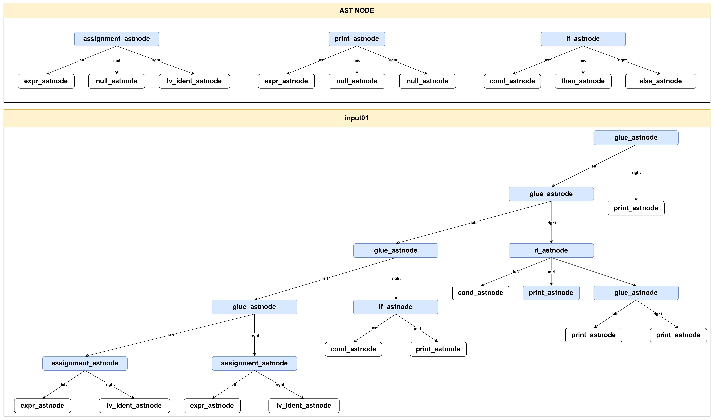

## 本章新增的语法

``` c
if(condition) {
    statements;
}
else {
    statements;
}
```



## 测试

**测试方法**
``` bash
cd 08_If_Statements
make clean
make
make test
```

**测试结果**
``` bash
--- 运行结果如下 ---
./build/out
36
72
10
25
--- 测试完成 ---
```